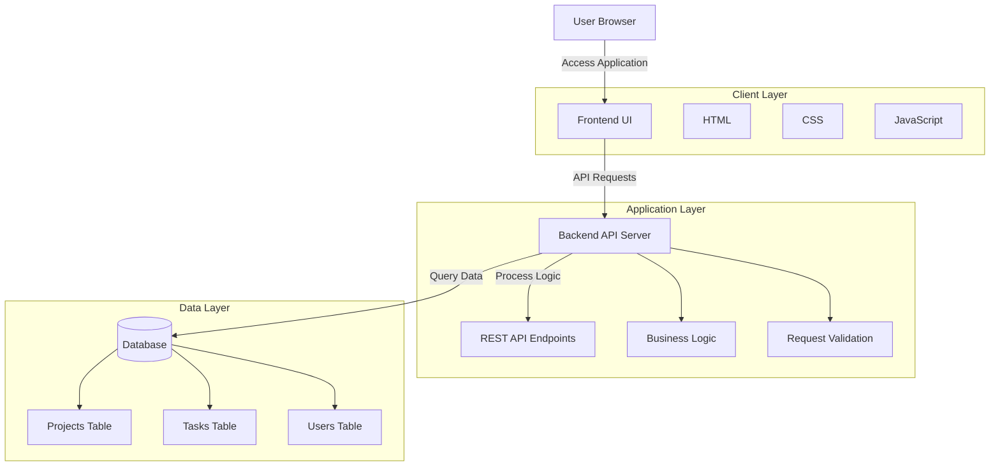
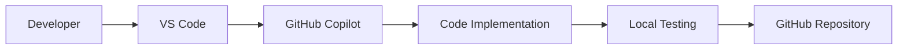
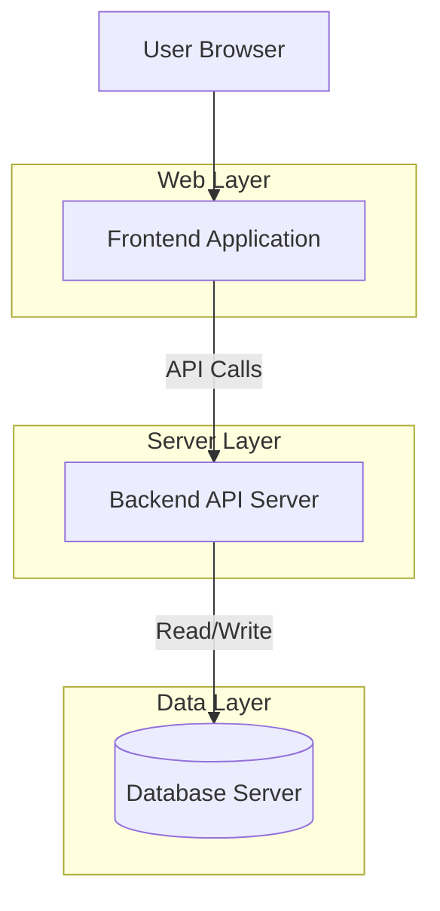
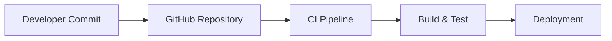

  # 🚀 Project Management App

<p align="center">


</p>

A **full-stack Project Management application** built with modern development tools and **AI-assisted coding using GitHub Copilot**.

This project is part of my **Vibe Coding learning journey**, where I explore building real applications faster using AI development assistants.

---

## 🌟 Project Highlights

- Built using **AI-assisted development**
- Designed with **modern full-stack architecture**
- Demonstrates **rapid prototyping with GitHub Copilot**
- Structured for **scalability and modular development**

## 📌 Project Overview

The **Project Management App** allows users to:

- Create and manage projects
- Organize tasks
- Track progress
- Maintain structured workflows

This project focuses on learning **AI-assisted development workflows** and modern **full-stack architecture**.

---

## 🏗 System Architecture

The Project Management application follows a **layered architecture** separating the frontend, backend services, and data storage. This design ensures modularity, scalability, and maintainability.



---

## ⚙️ Development Workflow

This project was built using **AI-assisted development** with GitHub Copilot to accelerate coding and experimentation.



---

## 🚀 Deployment Architecture

The application can be deployed using a typical **web application architecture**.



---

## ☁️ Cloud Deployment Runbooks

- [AWS Deployment Runbook](docs/AWS_DEPLOY_RUNBOOK.md)
- [Azure Deployment Runbook](docs/AZURE_DEPLOY_RUNBOOK.md)
- [GCP Deployment Runbook](docs/GCP_DEPLOY_RUNBOOK.md)

---

## 🔄 CI/CD Pipeline

The project can be integrated with **GitHub workflows for continuous integration and deployment**.



---

## 🤖 AI-Assisted Development

This project demonstrates **AI-assisted software development using GitHub Copilot**.

Benefits observed during development:

- Faster code generation
- Rapid prototyping
- Improved developer productivity
- Assistance with repetitive coding tasks

AI tools used:

- GitHub Copilot
- VS Code AI suggestions

---

## 📌 Architecture Summary

The system follows a **modern web application architecture**:

```
User
  ↓
Frontend (UI Layer)
  ↓
Backend API (Application Layer)
  ↓
Database (Data Layer)
```

This modular structure allows the system to scale easily while keeping components independent.


## 🎥 Demo


---

# ✨ Features

- 📁 Project creation and management  
- ✅ Task tracking and organization  
- 📊 Project progress monitoring  
- ⚡ AI-assisted coding workflow  
- 📦 Modular project structure  

---

## 🧰 Tech Stack

### Frontend
<p>

</p>

### Backend
<p>

</p>

### Development Tools
<p>

</p>

💻 Built with **AI-assisted development using GitHub Copilot**

---

## Environment Configuration (Auth + Mail)

Add these values to your environment configuration:

```env
# Existing AI config
OPENROUTER_API_KEY=your_openrouter_api_key

# Session/auth security
PM_SESSION_SECRET=replace_with_long_random_secret
PM_COOKIE_SECURE=false
PM_ENV=development

# Auth hardening controls
PM_AUTH_WINDOW_SECONDS=300
PM_AUTH_MAX_ATTEMPTS_PER_IP=30
PM_AUTH_LOCKOUT_THRESHOLD=5
PM_AUTH_LOCKOUT_SECONDS=900

# Password reset / Resend
RESEND_API_KEY=re_xxxxxxxxxxxxxxxxx
PM_MAIL_FROM=onboarding@resend.dev
PM_APP_BASE_URL=http://localhost:8000
PM_DEV_EXPOSE_RESET_TOKEN=true
```

Production recommendations:

1. Set `PM_ENV=production`
2. Set `PM_COOKIE_SECURE=true`
3. Set `PM_DEV_EXPOSE_RESET_TOKEN=false`
4. Use a verified sender/domain for `PM_MAIL_FROM`
5. Set `PM_APP_BASE_URL` to your public HTTPS URL

## Password Reset with Resend

The app now supports password reset request/confirm endpoints.

1. User requests reset from the login screen.
2. Backend generates a one-time token and stores only a hash in SQLite.
3. Backend sends reset email using Resend.
4. User submits token + new password to confirm reset.

Endpoints:

1. `POST /api/auth/password-reset/request`
2. `POST /api/auth/password-reset/confirm`

Notes:

1. In development mode, API may include `dev_reset_token` in the response to simplify local testing.
2. In production, disable token exposure with `PM_DEV_EXPOSE_RESET_TOKEN=false`.


