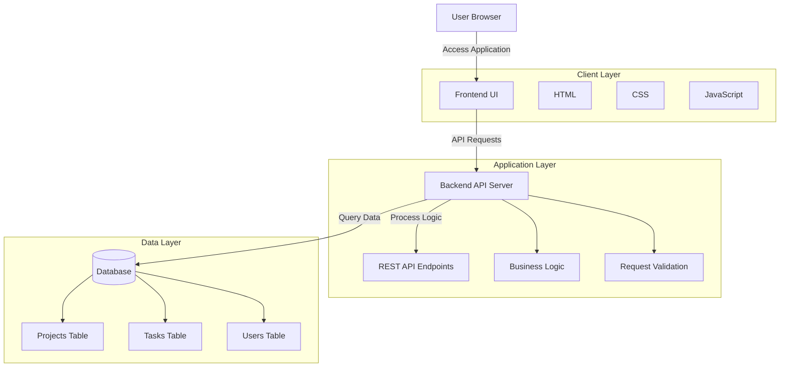
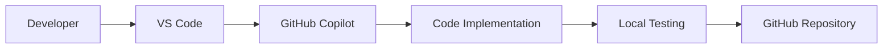
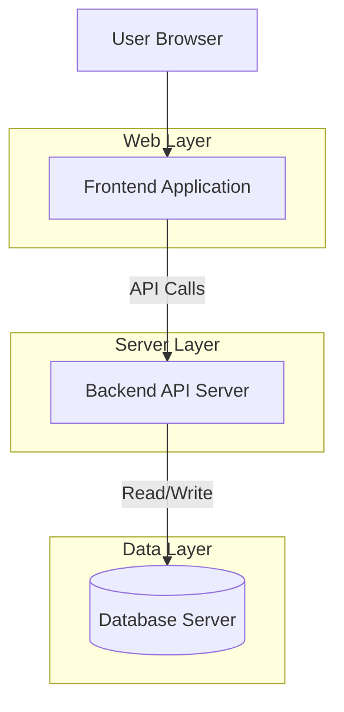
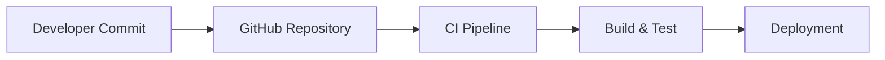
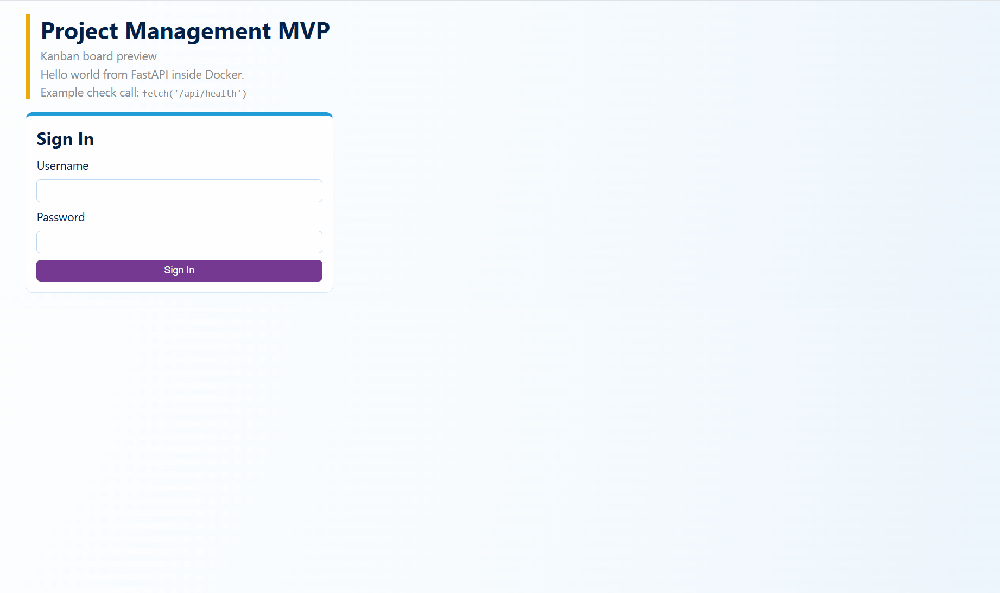

  # 🚀 Project Management App

<p align="center">


</p>

A **full-stack Project Management application** built with modern development tools and **AI-assisted coding using GitHub Copilot**.

This project is part of my **Vibe Coding learning journey**, where I explore building real applications faster using AI development assistants.

---

## 🌟 Project Highlights

- Built using **AI-assisted development**
- Designed with **modern full-stack architecture**
- Demonstrates **rapid prototyping with GitHub Copilot**
- Structured for **scalability and modular development**

## 📌 Project Overview

The **Project Management App** allows users to:

- Create and manage projects
- Organize tasks
- Track progress
- Maintain structured workflows

This project focuses on learning **AI-assisted development workflows** and modern **full-stack architecture**.

---

## 🏗 System Architecture

The Project Management application follows a **layered architecture** separating the frontend, backend services, and data storage. This design ensures modularity, scalability, and maintainability.



---

## ⚙️ Development Workflow

This project was built using **AI-assisted development** with GitHub Copilot to accelerate coding and experimentation.



---

## 🚀 Deployment Architecture

The application can be deployed using a typical **web application architecture**.



---

## 🔄 CI/CD Pipeline

The project can be integrated with **GitHub workflows for continuous integration and deployment**.



---

## 🤖 AI-Assisted Development

This project demonstrates **AI-assisted software development using GitHub Copilot**.

Benefits observed during development:

- Faster code generation
- Rapid prototyping
- Improved developer productivity
- Assistance with repetitive coding tasks

AI tools used:

- GitHub Copilot
- VS Code AI suggestions

---

## 📌 Architecture Summary

The system follows a **modern web application architecture**:

```
User
  ↓
Frontend (UI Layer)
  ↓
Backend API (Application Layer)
  ↓
Database (Data Layer)
```

This modular structure allows the system to scale easily while keeping components independent.


## 🎥 Demo

*(Add demo GIF or video here later)*



---

# ✨ Features

- 📁 Project creation and management  
- ✅ Task tracking and organization  
- 📊 Project progress monitoring  
- ⚡ AI-assisted coding workflow  
- 📦 Modular project structure  

---

## 🧰 Tech Stack

### Frontend
<p>

</p>

### Backend
<p>

</p>

### Development Tools
<p>

</p>

💻 Built with **AI-assisted development using GitHub Copilot**


